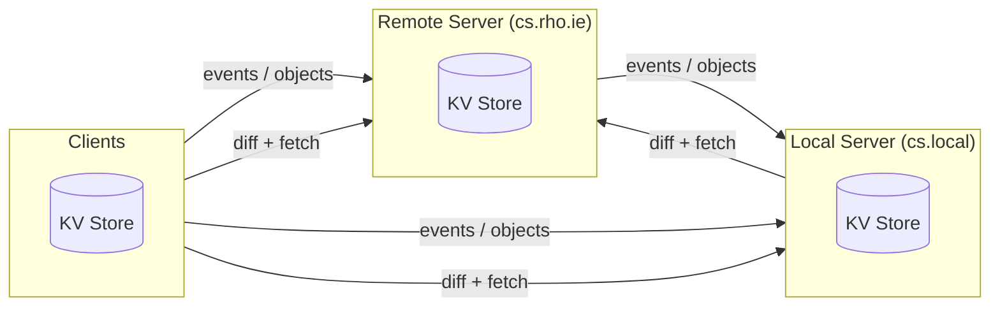

# common-storage

Efficiently sync appendable events and object storage.



## Routes

Common Storage is a REST HTTP API.

### `GET /feed`

Get basic information on how many entries are stored on the server, and when it was last updated.

**Query params**
- `?human` — flag; when present, timestamps are ISO 8601 strings instead of epoch ms

**Response** `200`
```json
{
  "topics": [{ "topic": "name", "count": 42, "lastUpdated": 1714393600000 }],
  "subscriptions": [{ "source": "https://…", "topic": "name", "frequency": 60, "created": 1714393600000 }]
}
```

---

### `GET /events/:topic`

Returns a paginated page of entries from an event topic, ordered by ID. Supports:
- NDJSON streaming for live tailing 
- Specific ID lookups for post-diff reconciliation.

**Path params**
- `:topic` — topic name

**Query params**
- `?start=<id>` — first ID to return (positive int); omit to start from the beginning
- `?size=<n>` — max entries to return (positive int)
- `?ids=1,2,5` — fetch a specific set of IDs instead of a range (non-empty, positive ints)
- `?filter=<expr>` — JMESPath expression; entries where it evaluates falsy are excluded; not available on streaming path

**Headers**
- `Accept: application/x-ndjson` — switch to unbounded NDJSON stream; `?start` becomes the cursor

**Response** `200` — paginated:
```json
{ "entries": [{ "id": 1, "createdAt": 0, "updatedAt": 0, "payload": {} }], "next": 2 }
```
`next` is `null` when the topic is exhausted. Stream: one JSON object per line.

---

### `GET /events/:topic/:id`

Returns a single event entry by its server-assigned ID.

**Path params**
- `:topic` — topic name
- `:id` — event ID (positive int)

**Response** `200`
```json
{ "id": 1, "createdAt": 0, "updatedAt": 0, "payload": {} }
```

---

### `POST /events/:topic`

Appends a new entry to an event topic. The server assigns the ID.

**Path params**
- `:topic` — topic name, 1–128 chars

**Headers**
- `Idempotency-Key` — optional; retries with the same key return the cached response

**Body**
```json
{ "payload": {} }
```

**Response** `201` — the created entry:
```json
{ "id": 42, "createdAt": 0, "updatedAt": 0, "payload": {} }
```

---

### `PUT /events/:topic/:id`

Upserts an event at a given ID; creates it if absent, updates if present. Used by federation to replicate entries with their original IDs.

**Path params**
- `:topic` — topic name, 1–128 chars
- `:id` — event ID (positive int)

**Headers**
- `Idempotency-Key` — optional; max 512 bytes

**Body**
```json
{ "payload": {}, "createdAt": 0, "updatedAt": 0 }
```
`createdAt` and `updatedAt` are optional; omit to use server time.

**Response** `200` (updated) or `201` (created):
```json
{ "id": 42, "createdAt": 0, "updatedAt": 0, "payload": {} }
```

---

### `GET /objects/:topic`

Returns a paginated page of object entries ordered by seq. Supports NDJSON streaming for live tailing. Tombstones (`payload: null`) are included in all responses so deletions propagate to subscribers.

**Path params**
- `:topic` — topic name

**Query params**
- `?start=<seq>` — first seq position to return (positive int)
- `?size=<n>` — max entries to return (positive int); defaults to 100
- `?filter=<expr>` — JMESPath expression applied to each entry's payload; not available on streaming path

**Headers**
- `Accept: application/x-ndjson` — switch to unbounded NDJSON stream ordered by seq; `?start` becomes the cursor

**Response** `200` — paginated:
```json
{ "entries": [{ "id": "key", "seq": 1, "createdAt": 0, "updatedAt": 0, "payload": {} }], "next": 2 }
```
`payload: null` denotes a tombstone. Stream: one JSON object per line.

---

### `GET /objects/:topic/:id`

Returns a single object entry by its client-supplied string ID.

**Path params**
- `:topic` — topic name
- `:id` — object ID (non-empty string)

**Response** `200`
```json
{ "id": "key", "seq": 1, "createdAt": 0, "updatedAt": 0, "payload": {} }
```

---

### `PUT /objects/:topic/:id`

Upserts an object entry at the given string ID. Creates it if absent; overwrites the payload and advances the seq if present.

**Path params**
- `:topic` — topic name
- `:id` — object ID (non-empty string)

**Headers**
- `Idempotency-Key` — optional; max 512 bytes

**Body**
```json
{ "payload": {} }
```

**Response** `200` (updated) or `201` (created):
```json
{ "id": "key", "seq": 1, "createdAt": 0, "updatedAt": 0, "payload": {} }
```

---

### `DELETE /objects/:topic/:id`

Writes a tombstone; does not remove the entry. Tombstones propagate to subscribers and are GC'd after the retention window.

**Path params**
- `:topic` — topic name
- `:id` — object ID (non-empty string)

**Response** `200` — the tombstone entry:
```json
{ "id": "key", "seq": 2, "createdAt": 0, "updatedAt": 0, "payload": null }
```

---

### `POST /diff/:topic`

Set reconciliation. The client sends bucket hashes covering the topic's ID (events) or seq (objects) space; the server returns which ranges differ.

**Path params**
- `:topic` — topic name, 1–128 chars

**Body**
```json
{
  "root": "<64-char lowercase hex SHA-256>",
  "buckets": [
    { "start": 0, "end": 500, "hash": "<64-char hex>" }
  ]
}
```
Bucket hashes are SHA-256 over concatenated `id || updatedAt` pairs (events) or `seq || updatedAt` pairs (objects), sorted ascending.

**Response** `204` — root hashes match; no action needed.

**Response** `200` — divergent ranges the client should re-fetch:
```json
{ "ranges": [{ "start": 0, "end": 500 }] }
```

## Services

`Deno.kv` is never used directly by routes. It interacts with storage through other layers.

`IStorageBackend` and `IAtomicWriter` provide the primitives for interacting with our KV stores.

`IFullStorage` implements route capabilities. We subdivide this mega-interface into smaller services:

- `ITopicService`
- `IEventService`
- `IObjectService`
- `IIdempotencyService`

Routes may only use these smaller interfaces.

## Configuration

The server reads a single JSON config file. The path is resolved in order:

1. `CMSTR_CONFIG_PATH` env var (for Deno Deploy — point to a `./config.json` committed alongside the code)
2. `$XDG_CONFIG_HOME/common-storage/config.json`

If the file is executable, the server runs it as a subprocess and reads its stdout as JSON. This mirrors the Ansible dynamic-inventory pattern — static and generated configs share the same interface.

```json
{
  "server": { "port": 9999 },
  "rootKey": "CMSTR_ROOT_KEY",
  "events": [{ "name": "bookmark" }],
  "objects": [{ "name": "notes" }],
  "tokens": [{ "name": "read-only", "caveats": { "methods": ["GET"] } }],
  "aliases": [{ "name": "local", "url": "http://localhost:9999" }]
}
```

## Authorisation

cmstr uses [Macaroons](https://en.wikipedia.org/wiki/Macaroons_(computer_science)) for bearer token auth. Every request must include `Authorization: Bearer <token>`.

One secret, the root key, is held in an env var named by `config.rootKey`. All tokens are HMAC-derived from it. Rotating the root key immediately invalidates all tokens.

`cs mint <name` looks up named entries in `config.tokens` and:
- derives a macaroon from the root key and caveats
- prints the serialised token(s)

Caveats reduce the power of a token.

| Caveat | Wire form | Effect |
|--------|-----------|--------|
| `topic` | `topic = <name>` | Restricts the token to one topic |
| `methods` | `methods = GET,POST` | Restricts allowed HTTP methods |
| `expires` | `time < 2026-12-31T00:00` | Token invalid after this ISO 8601 datetime |

The middleware performs a two-pass check:

1. **HMAC pass**: satisfies all caveats vacuously and calls `isValid(rootKey)`.
2. **Caveat pass**: re-verifies with real context (topic from the URL path, method from the request).

## Idempotency

## Caching

## Subscription & Syncing


